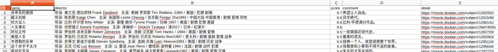

# 豆瓣网爬虫

如果对您有帮助，希望给个 Star ⭐，谢谢！😁😘🎁🎉

Github 项目地址 [pighui](https://github.com/pighui)/[douban](https://github.com/pighui/douban)

# 简介

基于Scrapy框架的豆瓣网top250电影信息爬取

爬虫入口地址：https://movie.douban.com/top250

实现了以下部分：

- 信息提取

电影名称、导演主演、评分、短评、详情链接

- mysql数据库存储
- csv数据存储

# 克隆项目

```bash
git clone git@github.com:pighui/douban.git
```

# 项目启动

## 1.安装Python

```
sudo apt install python
```

## 2.安装依赖包

```bash
cd douban
pip install -r requirements.txt
```

## 3.项目配置

修改settings.py文件

## 3.运行爬虫

```bash
scrapy crawl top
```

# 数据概览



有空慢慢看，一共250部电影，访问详情链接配合油猴就可以看了！！